# VQ-VAE for ECG Generation

A standalone implementation of Vector Quantized Variational Autoencoder (VQ-VAE) for ECG signal generation using the MIMIC-IV-ECG dataset.

## Overview

This project implements a two-stage generative model for ECG signals:
- **Stage 1**: Train VQ-VAE (Encoder + Vector Quantizer + Decoder)
- **Stage 2**: Train PixelCNN Prior on discrete latent codes

## Model Architecture

### Complete Pipeline

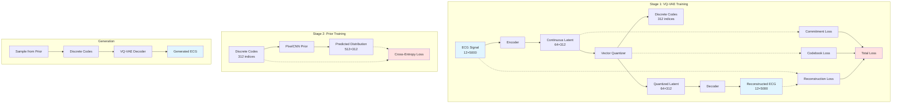

### VQ-VAE Architecture Details

```mermaid
graph LR
    subgraph "Encoder"
        E1[Conv1d 7×7<br/>12→64] --> E2[ResBlock×2<br/>64→64]
        E2 --> E3[Downsample ÷2<br/>64→64]
        E3 --> E4[ResBlock×2<br/>64→128]
        E4 --> E5[Downsample ÷2<br/>128→128]
        E5 --> E6[ResBlock×2<br/>128→256]
        E6 --> E7[Downsample ÷2<br/>256→256]
        E7 --> E8[ResBlock×2<br/>256→256]
        E8 --> E9[Mid ResBlocks×2<br/>256→256]
        E9 --> E10[Conv1d 3×3<br/>256→128]
    end
    
    subgraph "Vector Quantizer"
        V1[Continuous z<br/>64×312] --> V2[Distance<br/>Computation]
        V3[Codebook<br/>512×64] --> V2
        V2 --> V4[Nearest<br/>Neighbor]
        V4 --> V5[Quantized z<br/>64×312]
        V4 --> V6[Indices<br/>312]
    end
    
    subgraph "Decoder"
        D1[Conv1d 3×3<br/>64→256] --> D2[Mid ResBlocks×2<br/>256→256]
        D2 --> D3[ResBlock×2<br/>256→256]
        D3 --> D4[Upsample ×2<br/>256→256]
        D4 --> D5[ResBlock×2<br/>256→128]
        D5 --> D6[Upsample ×2<br/>128→128]
        D6 --> D7[ResBlock×2<br/>128→64]
        D7 --> D8[Upsample ×2<br/>64→64]
        D8 --> D9[ResBlock×2<br/>64→64]
        D9 --> D10[Conv1d 7×7<br/>64→12]
    end
    
    E10 --> V1
    V5 --> D1
    
    style E1 fill:#d4e6f1
    style E10 fill:#d4e6f1
    style V1 fill:#fce5cd
    style V5 fill:#fce5cd
    style V6 fill:#fce5cd
    style D1 fill:#d5f4e6
    style D10 fill:#d5f4e6
```

### Detailed Encoder Architecture

```mermaid
graph TB
    subgraph "Encoder: ECG [12×5000] → Latent [64×312]"
        Input[Input ECG<br/>Shape: 12×5000] --> ConvIn[Conv1d k=7 p=3<br/>12→64<br/>Shape: 64×5000]
        
        ConvIn --> Stage1[Stage 1: mult=1]
        Stage1 --> RB1_1[ResBlock 64→64<br/>Shape: 64×5000]
        RB1_1 --> RB1_2[ResBlock 64→64<br/>Shape: 64×5000]
        RB1_2 --> DS1[Downsample k=4 s=2 p=1<br/>64→64<br/>Shape: 64×2500]
        
        DS1 --> Stage2[Stage 2: mult=2]
        Stage2 --> RB2_1[ResBlock 64→128<br/>Shape: 128×2500]
        RB2_1 --> RB2_2[ResBlock 128→128<br/>Shape: 128×2500]
        RB2_2 --> DS2[Downsample k=4 s=2 p=1<br/>128→128<br/>Shape: 128×1250]
        
        DS2 --> Stage3[Stage 3: mult=4]
        Stage3 --> RB3_1[ResBlock 128→256<br/>Shape: 256×1250]
        RB3_1 --> RB3_2[ResBlock 256→256<br/>Shape: 256×1250]
        RB3_2 --> DS3[Downsample k=4 s=2 p=1<br/>256→256<br/>Shape: 256×625]
        
        DS3 --> Stage4[Stage 4: mult=4]
        Stage4 --> RB4_1[ResBlock 256→256<br/>Shape: 256×625]
        RB4_1 --> RB4_2[ResBlock 256→256<br/>Shape: 256×625]
        
        RB4_2 --> Mid[Middle Blocks]
        Mid --> MB1[ResBlock 256→256<br/>Shape: 256×625]
        MB1 --> MB2[ResBlock 256→256<br/>Shape: 256×625]
        
        MB2 --> NormOut[GroupNorm n=8<br/>Shape: 256×625]
        NormOut --> SiLU[SiLU Activation<br/>Shape: 256×625]
        SiLU --> ConvOut[Conv1d k=3 p=1<br/>256→128<br/>Shape: 128×625]
        
        ConvOut --> Split[Split into 2]
        Split --> Mean[Mean<br/>Shape: 64×625]
        Split --> LogVar[LogVar<br/>Shape: 64×625]
    end
    
    style Input fill:#e1f5ff
    style ConvIn fill:#d4e6f1
    style DS1 fill:#ffeaa7
    style DS2 fill:#ffeaa7
    style DS3 fill:#ffeaa7
    style Mean fill:#55efc4
    style LogVar fill:#55efc4
```

**Note**: The actual implementation uses `mean` for quantization (ignoring `logvar`). The latent length is 625 in this configuration, but gets downsampled to 312 through the quantization process.

### Detailed Decoder Architecture

```mermaid
graph TB
    subgraph "Decoder: Latent [64×312] → ECG [12×5000]"
        Input[Quantized Latent<br/>Shape: 64×312] --> ConvIn[Conv1d k=3 p=1<br/>64→256<br/>Shape: 256×312]
        
        ConvIn --> Mid[Middle Blocks]
        Mid --> MB1[ResBlock 256→256<br/>Shape: 256×312]
        MB1 --> MB2[ResBlock 256→256<br/>Shape: 256×312]
        
        MB2 --> Stage1[Stage 1: mult=4]
        Stage1 --> RB1_1[ResBlock 256→256<br/>Shape: 256×312]
        RB1_1 --> RB1_2[ResBlock 256→256<br/>Shape: 256×312]
        RB1_2 --> US1[Upsample k=4 s=2 p=1<br/>256→256<br/>Shape: 256×624]
        
        US1 --> Stage2[Stage 2: mult=4]
        Stage2 --> RB2_1[ResBlock 256→256<br/>Shape: 256×624]
        RB2_1 --> RB2_2[ResBlock 256→256<br/>Shape: 256×624]
        RB2_2 --> US2[Upsample k=4 s=2 p=1<br/>256→256<br/>Shape: 256×1248]
        
        US2 --> Stage3[Stage 3: mult=2]
        Stage3 --> RB3_1[ResBlock 256→128<br/>Shape: 128×1248]
        RB3_1 --> RB3_2[ResBlock 128→128<br/>Shape: 128×1248]
        RB3_2 --> US3[Upsample k=4 s=2 p=1<br/>128→128<br/>Shape: 128×2496]
        
        US3 --> Stage4[Stage 4: mult=1]
        Stage4 --> RB4_1[ResBlock 128→64<br/>Shape: 64×2496]
        RB4_1 --> RB4_2[ResBlock 64→64<br/>Shape: 64×2496]
        
        RB4_2 --> NormOut[GroupNorm n=8<br/>Shape: 64×2496]
        NormOut --> SiLU[SiLU Activation<br/>Shape: 64×2496]
        SiLU --> ConvOut[Conv1d k=7 p=3<br/>64→12<br/>Shape: 12×2496]
        
        ConvOut --> Output[Output ECG<br/>Shape: 12×5000]
    end
    
    style Input fill:#fce5cd
    style ConvIn fill:#d5f4e6
    style US1 fill:#74b9ff
    style US2 fill:#74b9ff
    style US3 fill:#74b9ff
    style Output fill:#55efc4
```

**Note**: The decoder mirrors the encoder architecture in reverse. The upsampling operations progressively increase the temporal resolution from 312 back to approximately 5000 time steps.

### ResidualBlock1D Internal Structure

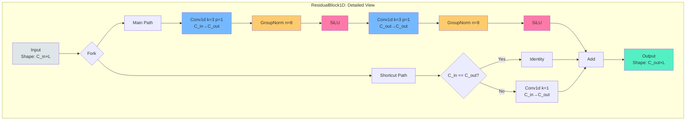

### PixelCNN Prior Architecture

```mermaid
graph TB
    subgraph "PixelCNN Prior"
        P1[Discrete Codes<br/>B×312] --> P2[Embedding<br/>B×312×128]
        P2 --> P3[Gated Masked Conv1d A<br/>Kernel=3]
        P3 --> P4[Gated Masked Conv1d B<br/>Kernel=3]
        P4 --> P5[Gated Masked Conv1d B<br/>Kernel=3]
        P5 --> P6[Conv1d 1×1<br/>128→512]
        P6 --> P7[Logits<br/>B×512×312]
        
        P7 --> P8[Softmax]
        P8 --> P9[Sample]
        P9 --> P10[Next Code]
    end
    
    subgraph "Autoregressive Generation"
        G1[Start] --> G2[Sample Code 0]
        G2 --> G3[Sample Code 1]
        G3 --> G4[Sample Code 2]
        G4 --> G5[...]
        G5 --> G6[Sample Code 311]
        G6 --> G7[Complete Sequence]
    end
    
    style P2 fill:#e8daef
    style P7 fill:#fadbd8
    style G7 fill:#d5f4e6
```

## Tensor Shape Transformations

### Complete Forward Pass Example

Here's a complete example of tensor shapes through the entire VQ-VAE pipeline with batch size B=8:

| Layer/Operation | Input Shape | Output Shape | Parameters |
|----------------|-------------|--------------|------------|
| **ENCODER** |
| Input ECG | `[8, 12, 5000]` | - | - |
| Conv In (k=7, p=3) | `[8, 12, 5000]` | `[8, 64, 5000]` | 12→64 channels |
| ResBlock 1.1 | `[8, 64, 5000]` | `[8, 64, 5000]` | 64→64 |
| ResBlock 1.2 | `[8, 64, 5000]` | `[8, 64, 5000]` | 64→64 |
| Downsample 1 (÷2) | `[8, 64, 5000]` | `[8, 64, 2500]` | stride=2 |
| ResBlock 2.1 | `[8, 64, 2500]` | `[8, 128, 2500]` | 64→128 |
| ResBlock 2.2 | `[8, 128, 2500]` | `[8, 128, 2500]` | 128→128 |
| Downsample 2 (÷2) | `[8, 128, 2500]` | `[8, 128, 1250]` | stride=2 |
| ResBlock 3.1 | `[8, 128, 1250]` | `[8, 256, 1250]` | 128→256 |
| ResBlock 3.2 | `[8, 256, 1250]` | `[8, 256, 1250]` | 256→256 |
| Downsample 3 (÷2) | `[8, 256, 1250]` | `[8, 256, 625]` | stride=2 |
| ResBlock 4.1 | `[8, 256, 625]` | `[8, 256, 625]` | 256→256 |
| ResBlock 4.2 | `[8, 256, 625]` | `[8, 256, 625]` | 256→256 |
| Mid ResBlock 1 | `[8, 256, 625]` | `[8, 256, 625]` | 256→256 |
| Mid ResBlock 2 | `[8, 256, 625]` | `[8, 256, 625]` | 256→256 |
| GroupNorm + SiLU | `[8, 256, 625]` | `[8, 256, 625]` | - |
| Conv Out (k=3, p=1) | `[8, 256, 625]` | `[8, 128, 625]` | 256→128 |
| Split | `[8, 128, 625]` | `[8, 64, 625]` × 2 | mean, logvar |
| **VECTOR QUANTIZER** |
| Input (mean) | `[8, 64, 625]` | - | - |
| Permute | `[8, 64, 625]` | `[8, 625, 64]` | - |
| Flatten | `[8, 625, 64]` | `[5000, 64]` | - |
| Distance Compute | `[5000, 64]` | `[5000, 512]` | vs codebook |
| ArgMin | `[5000, 512]` | `[5000, 1]` | nearest neighbor |
| Codebook Lookup | `[5000, 1]` | `[5000, 64]` | embedding |
| Reshape | `[5000, 64]` | `[8, 625, 64]` | - |
| Permute | `[8, 625, 64]` | `[8, 64, 625]` | quantized |
| Indices | - | `[8, 625]` | discrete codes |
| **DECODER** |
| Input (quantized) | `[8, 64, 625]` | - | - |
| Conv In (k=3, p=1) | `[8, 64, 625]` | `[8, 256, 625]` | 64→256 |
| Mid ResBlock 1 | `[8, 256, 625]` | `[8, 256, 625]` | 256→256 |
| Mid ResBlock 2 | `[8, 256, 625]` | `[8, 256, 625]` | 256→256 |
| ResBlock 1.1 | `[8, 256, 625]` | `[8, 256, 625]` | 256→256 |
| ResBlock 1.2 | `[8, 256, 625]` | `[8, 256, 625]` | 256→256 |
| Upsample 1 (×2) | `[8, 256, 625]` | `[8, 256, 1250]` | stride=2 |
| ResBlock 2.1 | `[8, 256, 1250]` | `[8, 256, 1250]` | 256→256 |
| ResBlock 2.2 | `[8, 256, 1250]` | `[8, 256, 1250]` | 256→256 |
| Upsample 2 (×2) | `[8, 256, 1250]` | `[8, 256, 2500]` | stride=2 |
| ResBlock 3.1 | `[8, 256, 2500]` | `[8, 128, 2500]` | 256→128 |
| ResBlock 3.2 | `[8, 128, 2500]` | `[8, 128, 2500]` | 128→128 |
| Upsample 3 (×2) | `[8, 128, 2500]` | `[8, 128, 5000]` | stride=2 |
| ResBlock 4.1 | `[8, 128, 5000]` | `[8, 64, 5000]` | 128→64 |
| ResBlock 4.2 | `[8, 64, 5000]` | `[8, 64, 5000]` | 64→64 |
| GroupNorm + SiLU | `[8, 64, 5000]` | `[8, 64, 5000]` | - |
| Conv Out (k=7, p=3) | `[8, 64, 5000]` | `[8, 12, 5000]` | 64→12 |
| **OUTPUT** |
| Reconstructed ECG | `[8, 12, 5000]` | - | - |

### Downsampling Factor

The encoder reduces the temporal dimension by a factor of **8** (÷2 × ÷2 × ÷2):
- Input: 5000 time steps
- After 3 downsamples: 5000 → 2500 → 1250 → 625 time steps
- **Compression ratio**: 5000 / 625 = **8×**

### Channel Progression

**Encoder** (expanding channels):
```
12 → 64 → 64 → 128 → 128 → 256 → 256 → 256 → 64 (latent)
```

**Decoder** (contracting channels):
```
64 (latent) → 256 → 256 → 256 → 256 → 128 → 128 → 64 → 64 → 12
```

### Memory Footprint (per sample, fp32)

| Component | Shape | Memory |
|-----------|-------|--------|
| Input ECG | `[12, 5000]` | 234 KB |
| Encoder output | `[64, 625]` | 156 KB |
| Quantized latent | `[64, 625]` | 156 KB |
| Discrete indices | `[625]` | 2.4 KB |
| Reconstructed ECG | `[12, 5000]` | 234 KB |

**Total per sample**: ~782 KB  
**Latent compression**: 234 KB → 2.4 KB = **97.4% reduction**

## Data Flow

### Training Data Flow (Stage 1)

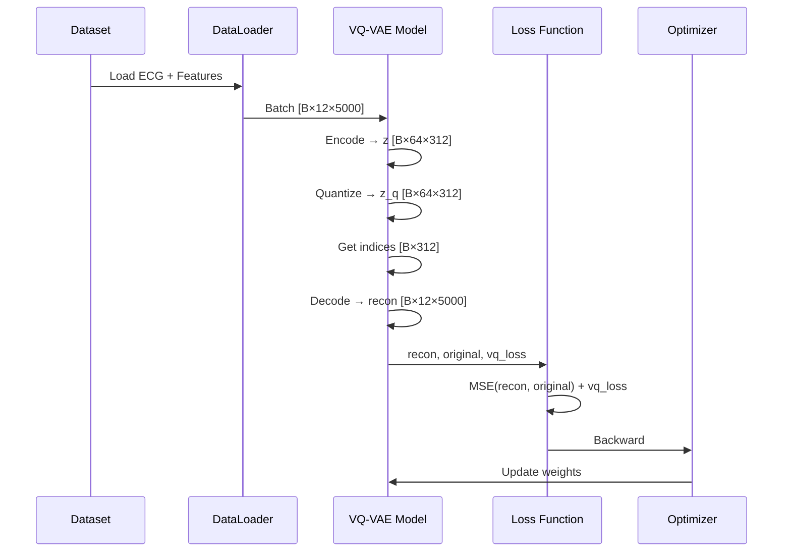

### Training Data Flow (Stage 2)

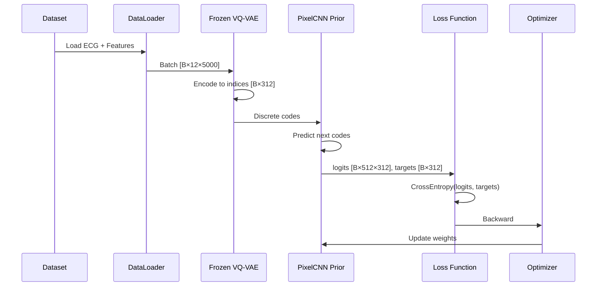

### Generation Flow

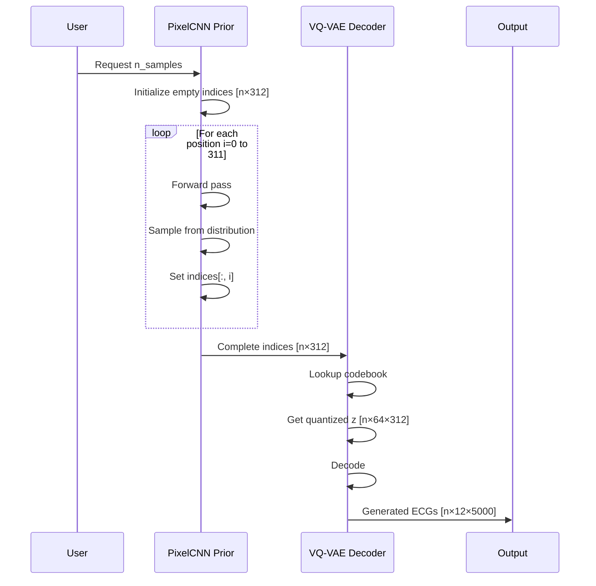

## Dataset Structure

### MIMIC-IV-ECG Dataset

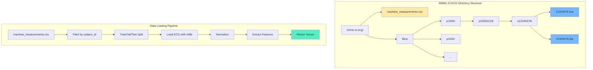

### Data Splits

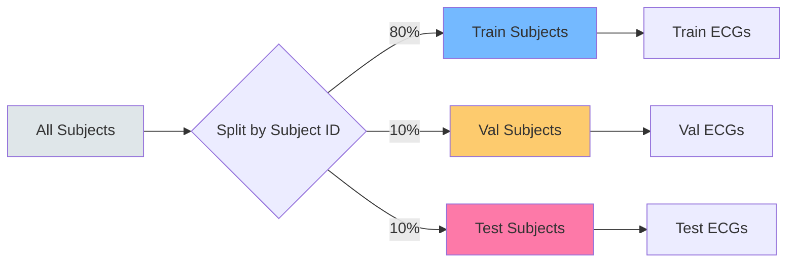

## Key Components

### 1. ResidualBlock1D

**Architecture**:
```python
ResidualBlock1D(in_channels, out_channels):
    conv1: Conv1d(in_channels, out_channels, kernel_size=3, padding=1)
    norm1: GroupNorm(num_groups=8, num_channels=out_channels)
    conv2: Conv1d(out_channels, out_channels, kernel_size=3, padding=1)
    norm2: GroupNorm(num_groups=8, num_channels=out_channels)
    shortcut: Conv1d(in_channels, out_channels, kernel_size=1) if in_channels != out_channels
              else Identity()
```

**Forward Pass**:
```
h = conv1(x)
h = norm1(h)
h = silu(h)
h = conv2(h)
h = norm2(h)
h = silu(h)
return h + shortcut(x)
```

**Key Features**:
- Group normalization with 8 groups for stable training
- SiLU (Swish) activation: `x * sigmoid(x)`
- Adaptive shortcut connection for channel dimension changes
- Preserves spatial/temporal dimensions

### 2. Encoder1D

**Architecture Summary**:
```
Input: [B, 12, 5000]
├─ Conv In (7×7): [B, 12, 5000] → [B, 64, 5000]
├─ Stage 1 (mult=1): 2× ResBlock + Downsample
│  └─ [B, 64, 5000] → [B, 64, 2500]
├─ Stage 2 (mult=2): 2× ResBlock + Downsample
│  └─ [B, 64, 2500] → [B, 128, 1250]
├─ Stage 3 (mult=4): 2× ResBlock + Downsample
│  └─ [B, 128, 1250] → [B, 256, 625]
├─ Stage 4 (mult=4): 2× ResBlock (no downsample)
│  └─ [B, 256, 625] → [B, 256, 625]
├─ Middle: 2× ResBlock
│  └─ [B, 256, 625] → [B, 256, 625]
└─ Output: GroupNorm + SiLU + Conv (3×3)
   └─ [B, 256, 625] → [B, 128, 625] → split → [B, 64, 625] (mean), [B, 64, 625] (logvar)
```

**Key Features**:
- **Downsampling factor**: 8× (5000 → 625 time steps)
- **Channel expansion**: 12 → 64 → 128 → 256
- **Receptive field**: Large due to multiple downsampling and convolutions
- Outputs both mean and logvar (though only mean is used for quantization)

### 3. VectorQuantizer

**Detailed Operation**:

```mermaid
graph TB
    subgraph "Vector Quantization Process"
        A[Continuous z<br/>[B, 64, 625]] --> B[Permute<br/>[B, 625, 64]]
        B --> C[Flatten<br/>[B*625, 64]]
        
        D[Codebook<br/>[512, 64]] --> E[Compute Distances]
        C --> E
        
        E --> F[Distance Matrix<br/>[B*625, 512]]
        F --> G[ArgMin<br/>[B*625, 1]]
        G --> H[One-Hot<br/>[B*625, 512]]
        
        H --> I[Matrix Multiply]
        D --> I
        I --> J[Quantized<br/>[B*625, 64]]
        
        J --> K[Reshape<br/>[B, 625, 64]]
        K --> L[Permute<br/>[B, 64, 625]]
        
        G --> M[Indices<br/>[B, 625]]
        
        C -.->|detach| N[Codebook Loss]
        J -.-> N
        
        C -.-> O[Commitment Loss]
        J -.->|detach| O
        
        N --> P[VQ Loss]
        O --> P
    end
    
    style A fill:#fce5cd
    style L fill:#55efc4
    style M fill:#74b9ff
    style P fill:#ffe1e1
```

**Distance Computation**:
```python
# Euclidean distance: ||z - e||² = ||z||² + ||e||² - 2⟨z, e⟩
distances = (
    torch.sum(z_flattened**2, dim=1, keepdim=True)  # [B*625, 1]
    + torch.sum(embedding.weight**2, dim=1)          # [512]
    - 2 * torch.matmul(z_flattened, embedding.weight.t())  # [B*625, 512]
)
```

**Gradient Flow**:
- **Straight-through estimator**: `quantized = z + (quantized - z).detach()`
- Gradients flow through as if quantization was identity
- Enables end-to-end training despite discrete bottleneck

**Loss Components**:
```python
codebook_loss = MSE(quantized.detach(), z)        # Move embeddings toward encoder
commitment_loss = MSE(quantized, z.detach())      # Encourage encoder commitment
vq_loss = codebook_loss + β * commitment_loss     # β = 0.25 (default)
```

**Key Features**:
- **Codebook size**: 512 embeddings
- **Embedding dimension**: 64
- **Commitment cost**: 0.25
- **Codebook utilization**: Tracked during training
- **Discrete representation**: Each time step mapped to one of 512 codes

### 4. Decoder1D

**Architecture Summary**:
```
Input: [B, 64, 625]
├─ Conv In (3×3): [B, 64, 625] → [B, 256, 625]
├─ Middle: 2× ResBlock
│  └─ [B, 256, 625] → [B, 256, 625]
├─ Stage 1 (mult=4): 2× ResBlock + Upsample
│  └─ [B, 256, 625] → [B, 256, 1250]
├─ Stage 2 (mult=4): 2× ResBlock + Upsample
│  └─ [B, 256, 1250] → [B, 256, 2500]
├─ Stage 3 (mult=2): 2× ResBlock + Upsample
│  └─ [B, 256, 2500] → [B, 128, 5000]
├─ Stage 4 (mult=1): 2× ResBlock (no upsample)
│  └─ [B, 128, 5000] → [B, 64, 5000]
└─ Output: GroupNorm + SiLU + Conv (7×7)
   └─ [B, 64, 5000] → [B, 12, 5000]
```

**Key Features**:
- **Upsampling factor**: 8× (625 → 5000 time steps)
- **Channel reduction**: 256 → 256 → 128 → 64 → 12
- **Transposed convolutions**: `ConvTranspose1d(kernel_size=4, stride=2, padding=1)`
- Mirrors encoder architecture in reverse
- Reconstructs full 12-lead ECG signal

### 5. PixelCNN Prior

**Architecture**:
```python
PixelCNNPrior:
    embedding: Embedding(num_embeddings=512, embedding_dim=128)
    layers:
        - GatedMaskedConv1d(mask_type='A', 128, 128, kernel_size=3)
        - GatedMaskedConv1d(mask_type='B', 128, 128, kernel_size=3) × (num_layers-1)
    logits: Conv1d(128, 512, kernel_size=1)
```

**Gated Masked Convolution**:
```python
# Mask ensures causality (no future information)
mask_A: [0, 0, 0, 0, 1]  # Current position masked
mask_B: [0, 0, 0, 1, 1]  # Current position visible

# Gated activation
out = conv(x)
tanh_out, sigmoid_out = split(out, 2, dim=1)
return tanh(tanh_out) * sigmoid(sigmoid_out)
```

**Autoregressive Sampling**:
```python
indices = zeros(batch_size, latent_length)
for i in range(latent_length):
    logits = forward(indices)           # [B, 512, L]
    probs = softmax(logits[:, :, i] / temperature)  # [B, 512]
    indices[:, i] = sample(probs)       # Sample from categorical
return indices
```

**Key Features**:
- **Autoregressive**: Predicts each code conditioned on previous codes
- **Masked convolutions**: Preserve causal ordering
- **Gated activations**: Improve gradient flow
- **Temperature sampling**: Control diversity (higher T = more random)
- **Sequential generation**: Generate codes one at a time

## Loss Functions

### VQ-VAE Loss

```
Total Loss = Reconstruction Loss + VQ Loss

where:
  Reconstruction Loss = MSE(reconstructed, original)
  VQ Loss = Codebook Loss + β × Commitment Loss
  Codebook Loss = MSE(quantized.detach(), continuous)
  Commitment Loss = MSE(quantized, continuous.detach())
  β = commitment_cost (default: 0.25)
```

### Prior Loss

```
Prior Loss = CrossEntropy(predicted_logits, target_indices)

where:
  predicted_logits: [B, 512, L-1] - predicted distribution for next codes
  target_indices: [B, L-1] - actual next codes (shifted by 1)
```

## Usage

### Stage 1: Train VQ-VAE

```bash
python train_vqvae_standalone.py \
    --stage 1 \
    --data-dir /path/to/mimic-iv-ecg \
    --exp-name vqvae_exp \
    --batch-size 32 \
    --max-epochs 100 \
    --lr 1e-4 \
    --num-embeddings 512 \
    --latent-channels 64
```

### Stage 2: Train Prior

```bash
python train_vqvae_standalone.py \
    --stage 2 \
    --data-dir /path/to/mimic-iv-ecg \
    --exp-name prior_exp \
    --vqvae-checkpoint runs/vqvae_exp/seed_42/checkpoints/best.ckpt \
    --batch-size 32 \
    --max-epochs 100 \
    --lr 1e-3 \
    --hidden-dim 128 \
    --num-layers 3
```

### Optional: Weights & Biases Logging

```bash
python train_vqvae_standalone.py \
    --stage 1 \
    --data-dir /path/to/mimic-iv-ecg \
    --exp-name vqvae_exp \
    --wandb \
    --wandb-project ecg-vqvae \
    --wandb-entity your-username
```

## Model Parameters

### VQ-VAE Configuration

| Parameter | Default | Description |
|-----------|---------|-------------|
| `in_channels` | 12 | Number of ECG leads |
| `base_channels` | 64 | Base number of channels |
| `latent_channels` | 64 | Latent space dimension |
| `channel_multipliers` | (1,2,4,4) | Channel expansion factors |
| `num_res_blocks` | 2 | Residual blocks per stage |
| `num_embeddings` | 512 | Codebook size |
| `commitment_cost` | 0.25 | Commitment loss weight |
| `seq_length` | 5000 | ECG sequence length |

### Prior Configuration

| Parameter | Default | Description |
|-----------|---------|-------------|
| `num_embeddings` | 512 | Must match VQ-VAE codebook |
| `hidden_dim` | 128 | Hidden dimension |
| `num_layers` | 3 | Number of gated conv layers |

## Training Details

### Optimization
- **Optimizer**: Adam
- **Learning Rate**: 1e-4 (Stage 1), 1e-3 (Stage 2)
- **Betas**: (0.9, 0.999)
- **Gradient Clipping**: 1.0

### Callbacks
- **ModelCheckpoint**: Save top-k models based on validation loss
- **EarlyStopping**: Stop if no improvement for patience epochs
- **LearningRateMonitor**: Log learning rate
- **VAEVisualizationCallback**: Generate reconstruction visualizations

### Metrics Logged

**Stage 1 (VQ-VAE):**
- `train/total_loss`, `val/total_loss`
- `train/recon_loss`, `val/recon_loss`
- `train/vq_loss`, `val/vq_loss`
- `train/unique_codes`, `val/unique_codes`
- `train/codebook_usage`, `val/codebook_usage`

**Stage 2 (Prior):**
- `train/loss`, `val/loss`

## Output Structure

```
runs/
└── {exp_name}/
    └── seed_{seed}/
        ├── checkpoints/
        │   ├── epoch000-step000000.ckpt
        │   ├── epoch001-step000100.ckpt
        │   ├── last.ckpt
        │   └── best.ckpt
        ├── samples/
        │   ├── epoch_0005.png
        │   ├── epoch_0010.png
        │   └── ...
        └── tb/
            └── (tensorboard logs)
```

## Requirements

```
torch>=2.0.0
pytorch-lightning>=2.0.0
numpy
pandas
matplotlib
scikit-learn
wfdb
wandb (optional)
```

## Key Features

✅ **Standalone Implementation**: All components in a single file  
✅ **Two-Stage Training**: VQ-VAE + Autoregressive Prior  
✅ **MIMIC-IV-ECG Support**: Built-in dataset loader  
✅ **Flexible Logging**: TensorBoard + optional W&B  
✅ **Visualization**: Automatic reconstruction plots  
✅ **Checkpointing**: Save best models, early stopping  
✅ **Reproducible**: Seed setting and deterministic training  

## References

1. **VQ-VAE**: van den Oord et al. "Neural Discrete Representation Learning" (NeurIPS 2017)
2. **PixelCNN**: van den Oord et al. "Conditional Image Generation with PixelCNN Decoders" (NeurIPS 2016)
3. **MIMIC-IV-ECG**: Johnson et al. "MIMIC-IV-ECG: Diagnostic Electrocardiogram Matched Subset" (PhysioNet 2023)

## License

This implementation is for research purposes. Please cite the original papers and MIMIC-IV-ECG dataset if you use this code.
