# VQ-VAE-2 Architecture & Training Process

VQ-VAE-2 for 12-lead ECG (Razavi et al., NeurIPS 2019), adapted for signals of shape **B × 12 × 5000** (12 leads, 10 s @ 500 Hz).

---

## 1. High-Level Model Architecture

Two-level hierarchical vector quantization: **bottom** level captures local morphology (QRS, P/T waves); **top** level captures global structure (rhythm, segments).

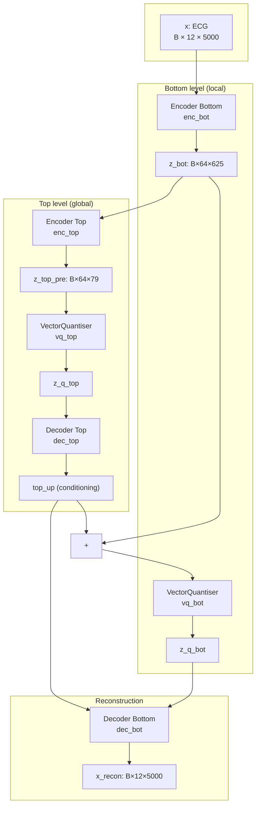

---

## 2. Temporal Dimensions (Default Strides ×8 per Level)

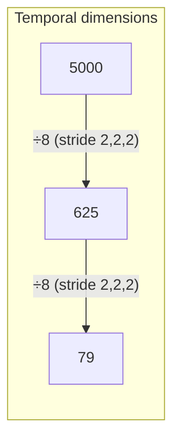

| Stage           | Shape        | Description                    |
|----------------|-------------|--------------------------------|
| Input          | B × 12 × 5000 | 12-lead ECG, 10 s             |
| After enc_bot  | B × 64 × 625  | Bottom latent (stride 8)      |
| After enc_top  | B × 64 × 79   | Top latent (stride ~8)        |

---

## 3. Building Blocks

### 3.1 Residual Block (1-D)

Pre-activation residual block used in both encoder and decoder.

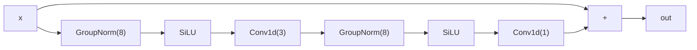

### 3.2 Encoder (1-D)

Strided convolutions halve the time dimension at each stride; then residual blocks.

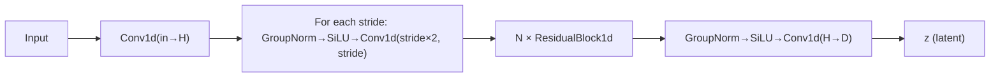

### 3.3 Decoder (1-D)

Mirrors encoder: residual blocks first, then transposed convolutions; optional conditioning channel-wise.

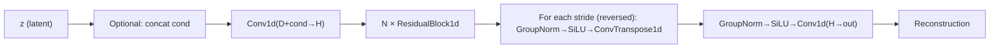

### 3.4 Vector Quantiser (EMA + Straight-Through)

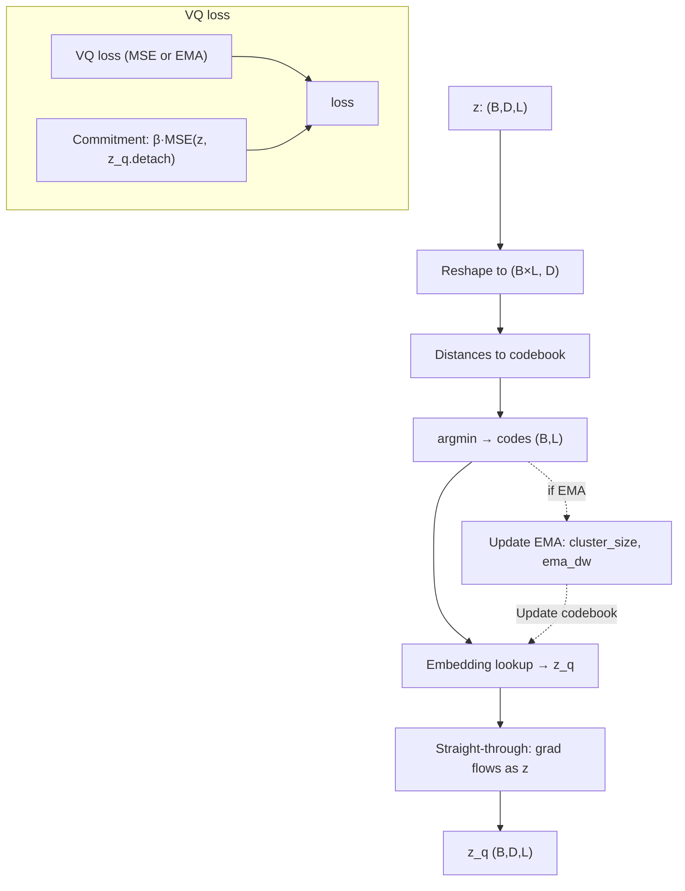

- **EMA**: exponential moving average of cluster assignments and embedding weights (no gradient through codebook when EMA is used).
- **Commitment cost** β = 0.25 encourages encoder to output close to chosen codebook vectors.

---

## 4. Encode Path (Step-by-Step)

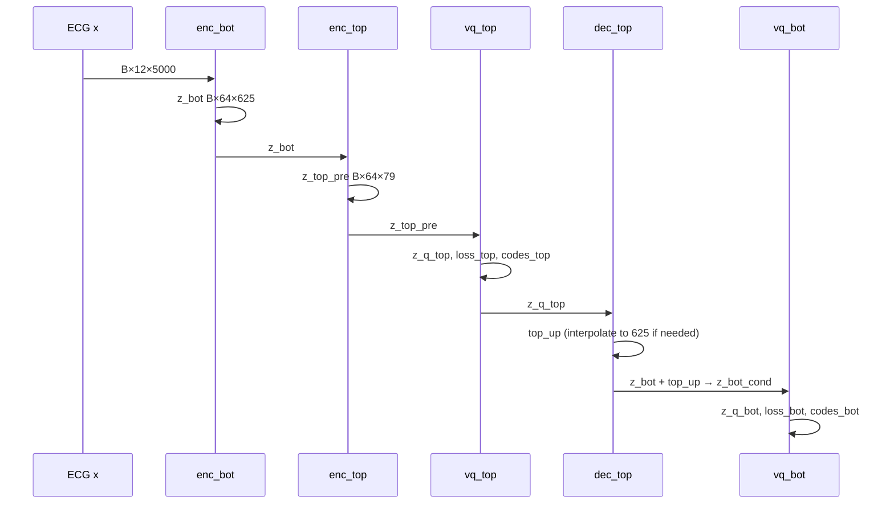

---

## 5. Decode Path (Reconstruction)

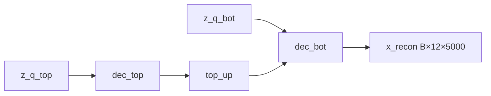

Decoder bottom takes **z_q_bot** and conditions on **top_up** (decoder-top output), then outputs **x_recon**.

---

## 6. Training Process (Step-by-Step)

End-to-end training flow with PyTorch Lightning.

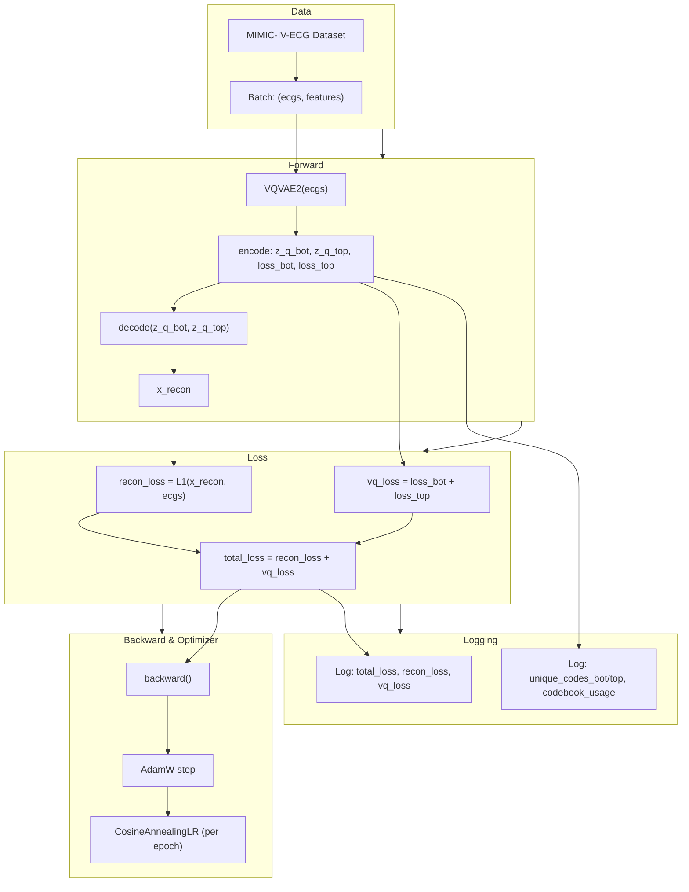

---

## 7. Training Loop (Epoch / Batch)

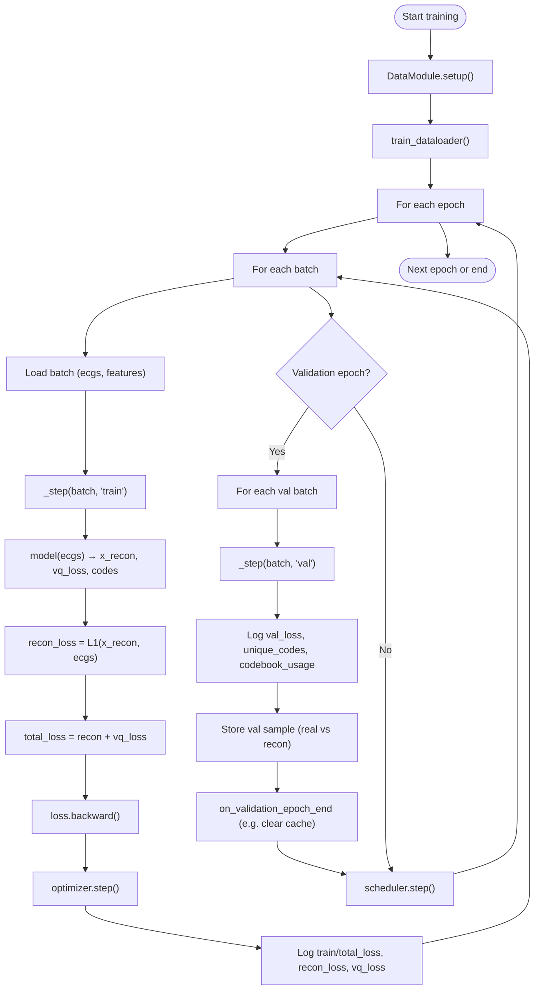

---

## 8. Loss Summary

| Loss            | Formula / role |
|-----------------|----------------|
| **Reconstruction** | L1(x_recon, x) |
| **VQ (top)**    | VQ loss from vq_top + β × commitment (z_top, z_q_top) |
| **VQ (bottom)** | VQ loss from vq_bot + β × commitment (z_bot_cond, z_q_bot) |
| **Total**       | recon_loss + vq_loss (vq_loss = loss_bot + loss_top) |

Optimizer: **AdamW** (lr=3e-4, betas=(0.9, 0.999), weight_decay=1e-4).  
Scheduler: **CosineAnnealingLR** (T_max=max_epochs, eta_min=0.1×lr).

---

## 9. Sampling (Decode from Codes)

For generation, the model can decode from discrete codes without running the encoder:

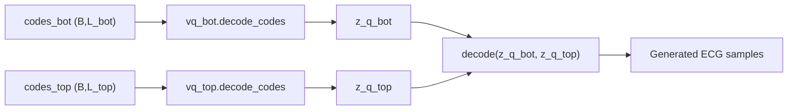

A prior (e.g. PixelSNAIL, Transformer) can be trained on **(codes_bot, codes_top)** to sample new codes; this module then decodes them to ECG with **decode_codes**.
