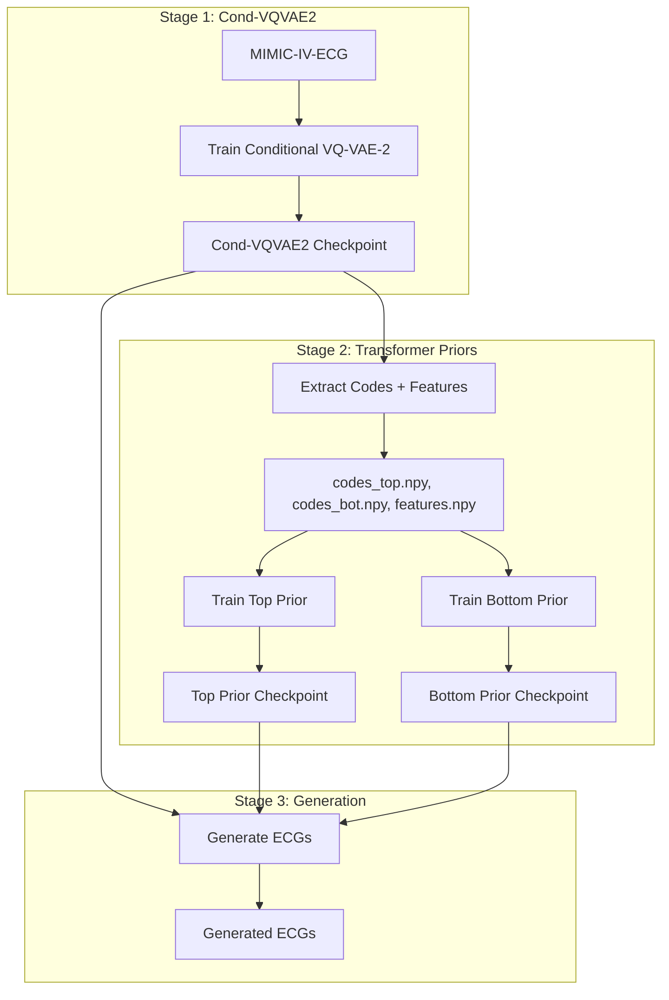
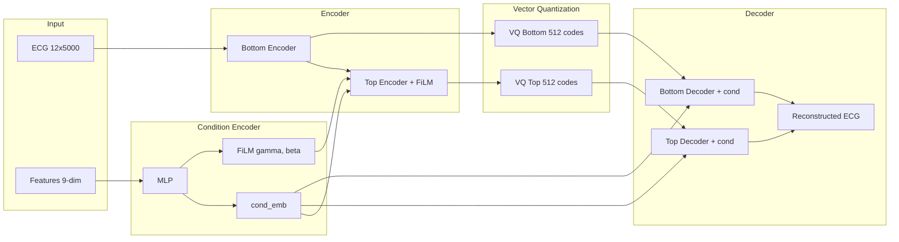
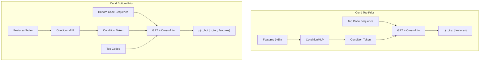
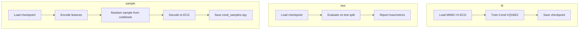
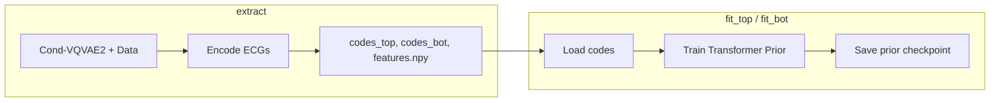
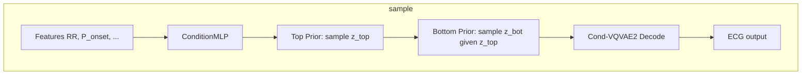
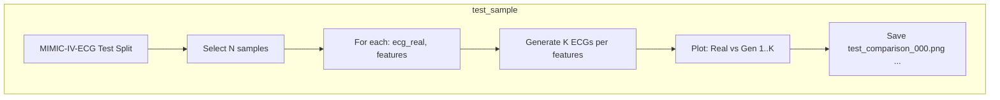
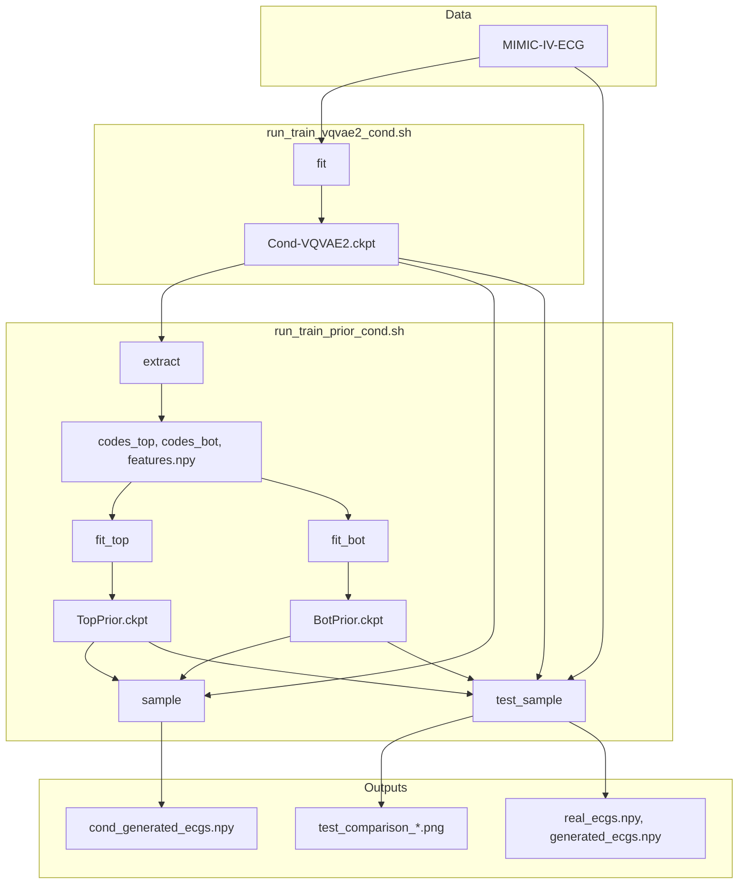

# Conditional VQ-VAE-2 for 12-Lead ECG Generation

This directory implements a **conditional** variant of VQ-VAE-2 for generating 12-lead ECGs conditioned on 9 clinical features (RR interval, P onset/end, QRS onset/end, T end, P/QRS/T axes). Two shell scripts provide a unified interface for training and inference.

## Overview



## Model Architecture

### Conditional VQ-VAE-2

The model extends VQ-VAE-2 (Razavi et al., NeurIPS 2019) with conditioning on 9 clinical features (normalized):

| Feature    | Description  |
|-----------|--------------|
| RR Interval | Heart rate interval |
| P Onset, P End | P-wave boundaries |
| QRS Onset, QRS End | QRS complex boundaries |
| T End | T-wave end |
| P Axis, QRS Axis, T Axis | Electrical axes |



**Conditioning strategy:**
- **FiLM** (scale + shift) on top encoder output
- **Channel-wise concatenation** of condition embedding in both decoders

### Conditional Transformer Priors

Two autoregressive transformers learn the prior over discrete codes:



- **Top Prior**: GPT-style, seq_len=78, learns p(z_top | features) via cross-attention to condition token
- **Bottom Prior**: GPT-style, seq_len=625, learns p(z_bot | z_top, features) via cross-attention to top codes + condition token

---

## Script 1: run_train_vqvae2_cond.sh

Trains and uses the **Conditional VQ-VAE-2** model (Stage 1).

### Commands

| Command | Description |
|---------|-------------|
| `fit` | Train the Conditional VQ-VAE-2 |
| `test <ckpt>` | Evaluate a checkpoint on test data |
| `sample <ckpt>` | Generate ECGs for given clinical features |

### Flow Diagram



### Environment Variables (run_train_vqvae2_cond.sh)

| Variable | Default | Description |
|----------|---------|-------------|
| **Data** | | |
| DATA_DIR | (MIMIC path) | Path to MIMIC-IV-ECG dataset |
| **Experiment** | | |
| EXP_NAME | cond_vqvae2_mimic | Experiment name |
| SEED | 42 | Random seed |
| RUNS_ROOT | runs | Root for experiment outputs |
| **Data settings** | | |
| BATCH_SIZE | 32 | Training batch size |
| NUM_WORKERS | 4 | DataLoader workers |
| MAX_SAMPLES | 1000 | Max samples (use `null` for full) |
| VAL_SPLIT | 0.1 | Validation fraction |
| TEST_SPLIT | 0.1 | Test fraction |
| **Model** | | |
| N_LEADS | 12 | Number of ECG leads |
| SIGNAL_LEN | 5000 | Signal length |
| HIDDEN_CHANNELS | 128 | Hidden channels |
| RESIDUAL_CHANNELS | 64 | Residual block channels |
| N_RES_BLOCKS | 4 | Residual blocks |
| N_EMBEDDINGS_TOP | 512 | Top codebook size |
| N_EMBEDDINGS_BOT | 512 | Bottom codebook size |
| EMBEDDING_DIM | 64 | Embedding dimension |
| COND_DIM | 128 | Condition embedding dimension |
| COMMITMENT_COST | 0.25 | VQ commitment cost |
| EMA_DECAY | 0.99 | EMA decay for codebook |
| **Training** | | |
| LR | 0.0003 | Learning rate |
| B1, B2 | 0.9, 0.999 | Adam betas |
| MAX_EPOCHS | 200 | Max training epochs |
| ACCELERATOR | gpu | Device |
| DEVICES | 0 | GPU IDs |
| LOG_EVERY_N_STEPS | 50 | Logging interval |
| CHECK_VAL_EVERY_N_EPOCH | 1 | Validation frequency |
| GRADIENT_CLIP | 1.0 | Gradient clipping |
| PATIENCE | 15 | Early stopping patience |
| SAVE_TOP_K | 3 | Best checkpoints to keep |
| VIZ_EVERY_N_EPOCHS | 5 | Visualization frequency |
| VIZ_NUM_SAMPLES | 4 | Samples per viz |
| **W&B** | | |
| WANDB_ENABLED | true | Enable Weights & Biases |
| WANDB_PROJECT | ecg-cond-vqvae2 | Project name |
| WANDB_ENTITY | | Entity (username/team) |
| WANDB_RUN_NAME | | Custom run name |
| WANDB_TAGS | | Tags |
| **Sampling** | | |
| N_SAMPLES | 8 | Samples to generate |
| TEMPERATURE | 1.0 | Sampling temperature |
| OUTPUT_FILE | cond_samples.npy | Output path |
| PLOT | false | Save PNG of samples |
| RR_INTERVAL, P_ONSET, P_END | 0.0 | Clinical features (normalized) |
| QRS_ONSET, QRS_END, T_END | 0.0 | |
| P_AXIS, QRS_AXIS, T_AXIS | 0.0 | |

### Usage Examples

```bash
# Train
./run_train_vqvae2_cond.sh fit

# Train with custom settings
BATCH_SIZE=64 MAX_EPOCHS=100 ./run_train_vqvae2_cond.sh fit

# Test
./run_train_vqvae2_cond.sh test runs/cond_vqvae2_mimic/seed_42/checkpoints/last.ckpt

# Sample with custom features (VQ-VAE only, no prior)
RR_INTERVAL=0.34 P_ONSET=-0.56 N_SAMPLES=8 PLOT=true \
  ./run_train_vqvae2_cond.sh sample runs/cond_vqvae2_mimic/seed_42/checkpoints/last.ckpt
```

---

## Script 2: run_train_prior_cond.sh

Trains **Conditional Transformer Priors** and generates ECGs (Stages 2 and 3).

### Commands

| Command | Description |
|---------|-------------|
| `extract` | Extract codes + features from Cond-VQVAE2 |
| `fit_top` | Train conditional top prior |
| `fit_bot` | Train conditional bottom prior |
| `sample` | Generate ECGs from priors (manual features) |
| `test_sample` | Load N test ECGs, generate K each, compare visually |

### Training Flow



### Generation Flow (sample)



### Test Sample Flow (test_sample)



### Environment Variables (run_train_prior_cond.sh)

| Variable | Default | Description |
|----------|---------|-------------|
| **Paths** | | |
| DATA_DIR | (MIMIC path) | MIMIC-IV-ECG data directory |
| VQVAE_CKPT | runs/cond_vqvae2_mimic/.../last.ckpt | Cond-VQVAE2 checkpoint |
| CODES_DIR | codes/cond_vqvae2_mimic | Extracted codes directory |
| **Extraction** | | |
| EXTRACT_BATCH_SIZE | 32 | Batch size for extract |
| MAX_SAMPLES | 1000 | Max samples (empty = all) |
| **Top Prior** | | |
| TOP_BATCH_SIZE | 16 | Batch size |
| TOP_MAX_EPOCHS | 100 | Max epochs |
| TOP_LR | 0.0003 | Learning rate |
| TOP_D_MODEL | 256 | Model dimension |
| TOP_N_LAYERS | 8 | Transformer layers |
| TOP_N_HEADS | 8 | Attention heads |
| TOP_COND_DIM | 128 | Condition dim (must match training) |
| **Bottom Prior** | | |
| BOT_BATCH_SIZE | 8 | Batch size |
| BOT_MAX_EPOCHS | 100 | Max epochs |
| BOT_LR | 0.0003 | Learning rate |
| BOT_D_MODEL | 512 | Model dimension |
| BOT_N_LAYERS | 12 | Transformer layers |
| BOT_N_HEADS | 8 | Attention heads |
| BOT_COND_DIM | 128 | Condition dim |
| **Checkpoints** | | |
| TOP_PRIOR_CKPT | logs/cond_top_prior/.../last.ckpt | Top prior path |
| BOT_PRIOR_CKPT | logs/cond_bot_prior/.../last.ckpt | Bottom prior path |
| **Sampling** | | |
| N_SAMPLES | 8 | Samples (sample command) |
| TOP_TEMP, BOT_TEMP | 1.0 | Sampling temperature |
| TOP_P | 0.95 | Nucleus sampling top-p |
| OUTPUT_FILE | cond_generated_ecgs.npy | Output path |
| PLOT | true | Save PNG |
| COND_DIM | 128 | Must match prior training |
| **test_sample** | | |
| N_TEST | 4 | Number of test samples |
| K_PER_FEATURE | 4 | Generated samples per feature set |
| TEST_OUT_DIR | test_comparisons | Output directory |
| TEST_SEED | 42 | Seed for test split |
| **Clinical features** (sample) | | |
| RR_INTERVAL, P_ONSET, P_END | 0.0 | Normalized values |
| QRS_ONSET, QRS_END, T_END | 0.0 | |
| P_AXIS, QRS_AXIS, T_AXIS | 0.0 | |
| **W&B** | | |
| WANDB_ENABLED | true | Enable W&B |
| WANDB_PROJECT | cond-vqvae2-prior | Project name |
| WANDB_ENTITY | | |
| WANDB_RUN_NAME | | |
| GPUS | 0 | GPU ID |

### Usage Examples

```bash
# Full pipeline (run in order)
./run_train_prior_cond.sh extract
./run_train_prior_cond.sh fit_top
./run_train_prior_cond.sh fit_bot

# Sample with manual features
N_SAMPLES=16 RR_INTERVAL=0.34 P_ONSET=-0.56 PLOT=true ./run_train_prior_cond.sh sample

# Test sample: compare real vs generated
N_TEST=4 K_PER_FEATURE=4 ./run_train_prior_cond.sh test_sample
```

---

## Complete Pipeline Diagram



---

## Prerequisites

- **Data**: MIMIC-IV-ECG dataset with `machine_measurements.csv` and WFDB files
- **Python**: PyTorch, PyTorch Lightning, WFDB, matplotlib, numpy
- **Directory layout**: `vqvae2_conditional/` must be a sibling of `vqvae2/` (for imports)

## Quick Start

```bash
cd vqvae2_conditional

# 1. Train Cond-VQVAE2
./run_train_vqvae2_cond.sh fit

# 2. Extract codes
./run_train_prior_cond.sh extract

# 3. Train priors
./run_train_prior_cond.sh fit_top
./run_train_prior_cond.sh fit_bot

# 4. Generate samples
./run_train_prior_cond.sh sample

# 5. Test with real data
./run_train_prior_cond.sh test_sample
```
